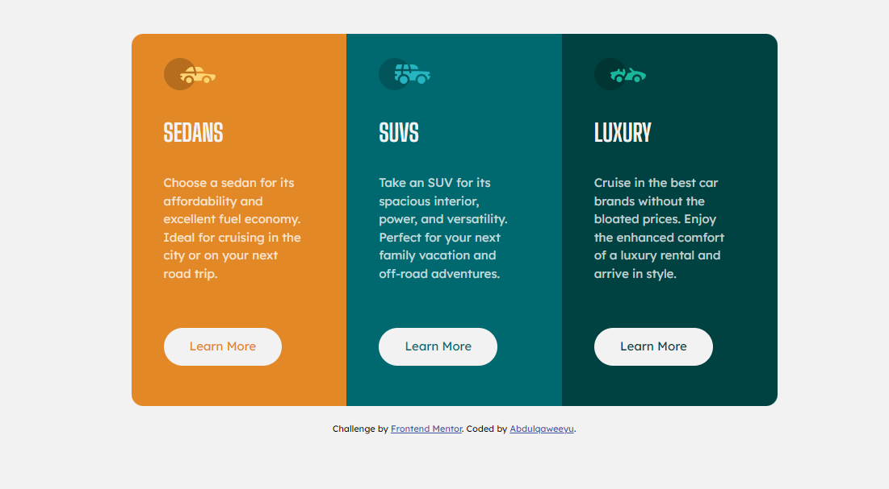

# Frontend Mentor - 3-column preview card component solution

This is a solution to the [3-column preview card component challenge on Frontend Mentor](https://www.frontendmentor.io/challenges/3column-preview-card-component-pH92eAR2-). Frontend Mentor challenges help you improve your coding skills by building realistic projects. 

## Table of contents

- [Overview](#overview)
  - [The challenge](#the-challenge)
  - [Screenshot](#screenshot)
  - [Links](#links)
- [My process](#my-process)
  - [Built with](#built-with)
  - [What I learned](#what-i-learned)
  - [Continued development](#continued-development)
  - [Useful resources](#useful-resources)
- [Author](#author)


## Overview

### The challenge

Users should be able to:

- View the optimal layout depending on their device's screen size
- See hover states for interactive elements

### Screenshot




### Links

- Solution URL: [Solution Link](https://github.com/ABQ4539/3-column-card)
- Live Site URL: [3 column preview card component](https://abq4539.github.io/3-column-card/)

## My process

### Built with

- Semantic HTML5 markup
- CSS custom properties
- Flexbox
- Mobile-first workflow
- Responsive Web Design

### What I learned

I learnt how to make a web page responsive, adjustable screen sizes for mobile and desktop screens. i learnt how to do this using **CSS media query**. An example is shown below

First the design for mobile:

```css
.container {
    max-width: 325px;
    margin-top: 50px;
    margin-bottom: 20px;
    margin-left: auto;
    margin-right: auto;
}
```
Then the desktop design:

```css
@media (min-width: 786px) {
    .container {
        max-width: 800px;
        height: auto;
        display: flex;
        justify-content: center;
        align-items: center;
    }
}
```

### Continued development

My focus now will be on CSS grid layout and bootstrap.

### Useful resources

- [Pointer Cursor](https://www.tutorialrepublic.com/faq/how-to-change-the-cursor-into-a-hand-pointer-on-hover-using-css.php) - This helped me for changing the mouse cursor to a pointer for a hover effect.
- [Responsive Web Design](https://www.w3schools.com/css/css_rwd_mediaqueries.asp) - This is an amazing article which helped me finally understand Responsive Web design and Media queries. I'd recommend it to anyone still learning this concept.


## Author

- Frontend Mentor - [@ABQ4539](https://www.frontendmentor.io/profile/ABQ4539)
